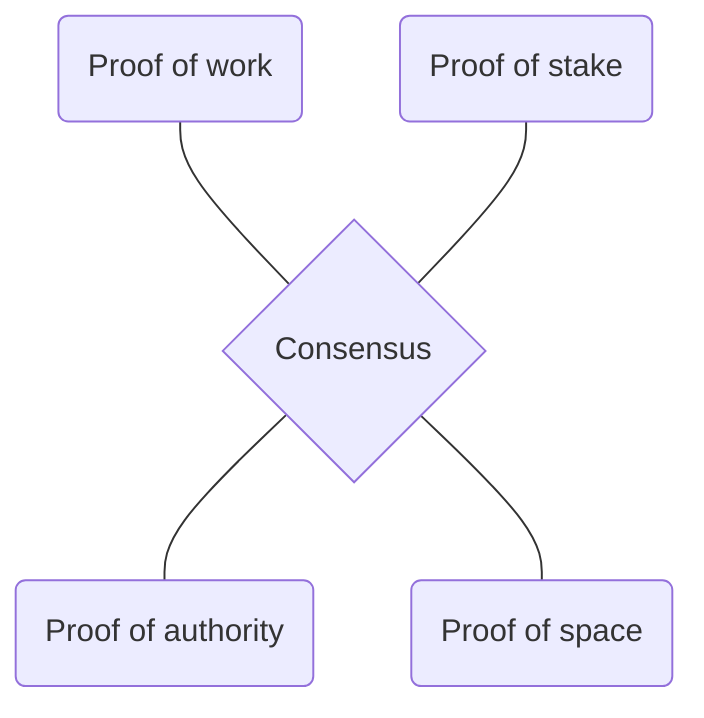

# Consensusvarianten

Om het probleem van dubbele uitgaven te voorkomen, worden **gecentraliseerde** en **gedecentraliseerde** oplossingen gebruikt.

### gecentraliseerde
> In een centrale oplossing controleert een vertrouwde derde partij op internet of het token al is uitgegeven en voorkomt zo dubbele uitgifte.

### gedecentraliseerde
> Gedistribueerde systemen gebruiken algoritmen voor transactiebevestiging die gegevenssynchronisatie mogelijk maken.

- *Proof of work*: dit is de bekendste. Er worden bewust eisen gesteld aan een blok, dus syndicaat-miners moeten veel rekenwerk doen om een blok te vinden dat aan de eisen voldoet.

Nonce
---
> Vaak moet aan het voorlopige blok **een getal (een nonce)** toegevoegd worden dat ervoor *zorgt dat de totale hash van het blok met een bepaald aantal nullen (voorloopnullen) begint*.

De juiste nonce kan alleen worden gevonden door vele malen te proberen (Brute Force), wat resulteert in constante berekeningen door veel computers. Wanneer het juiste blok is aangekondigd, is het voor andere miners niet langer nuttig om naar hun eigen versie van het volgende blok te zoeken, maar proberen ze een nieuw blok te maken op basis van het aangekondigde blok.

bloktime
---
Om de bloktijd **(de snelheid waarmee steeds een nieuw blok ontstaat)** constant te houden, wordt het aantal voorloopnullen eens in de zoveel tijd bijgesteld.
Gegeven een bepaalde rekenkracht is het een kwestie van geluk om snel zo'n blok te vinden, dus met een beperkte rekenkracht maakt men toch een evenredige kans.

miningpools
---
Er zijn ook miningpools actief op internet, waar mensen  hun computerverwerkingskracht kunnen combineren om gezamenlijk te zoeken naar gedeelde blokken die op elk moment op aanvraag kunnen worden voltooid. Het is geen kleine kans om een grote beloning te krijgen, maar een grote kans om er een stukje van te krijgen.

---
> Op proof of work is veel kritiek omdat dit erg veel energie kost.

De kritiek op proof of work is dat dit erg veel energie kost. Overigens is er geen duidelijk systeem dat het energieverbruik van individuele transacties en/of particulier bezit van cryptocurrencies of transacties meer bijdraagt aan het energieverbruik dan een persoon die kleine transacties uitvoert.

> De Zweed Erik Thedéen, vicevoorzitter van de Europese Autoriteit voor effecten en markten (ESMA), heeft de EU opgeroepen tot een verbod op proof of work cryptomining. De reden is het grote energieverbruik, ook als het groene energie betreft.

# Consensusvarianten

Om het probleem van dubbele uitgaven te voorkomen, worden **gecentraliseerde** en **gedecentraliseerde** oplossingen gebruikt.

### gecentraliseerde
> In een centrale oplossing controleert een vertrouwde derde partij op internet of het token al is uitgegeven en voorkomt zo dubbele uitgifte.

### gedecentraliseerde
> Gedistribueerde systemen gebruiken algoritmen voor transactiebevestiging die gegevenssynchronisatie mogelijk maken.

- *Proof of work*: dit is de bekendste. Er worden bewust eisen gesteld aan een blok, dus syndicaat-miners moeten veel rekenwerk doen om een blok te vinden dat aan de eisen voldoet.

Nonce
---
> Vaak moet aan het voorlopige blok **een getal (een nonce)** toegevoegd worden dat ervoor *zorgt dat de totale hash van het blok met een bepaald aantal nullen (voorloopnullen) begint*.

De juiste nonce kan alleen worden gevonden door vele malen te proberen (Brute Force), wat resulteert in constante berekeningen door veel computers. Wanneer het juiste blok is aangekondigd, is het voor andere miners niet langer nuttig om naar hun eigen versie van het volgende blok te zoeken, maar proberen ze een nieuw blok te maken op basis van het aangekondigde blok.

bloktime
---
Om de bloktijd **(de snelheid waarmee steeds een nieuw blok ontstaat)** constant te houden, wordt het aantal voorloopnullen eens in de zoveel tijd bijgesteld.
Gegeven een bepaalde rekenkracht is het een kwestie van geluk om snel zo'n blok te vinden, dus met een beperkte rekenkracht maakt men toch een evenredige kans.

miningpools
---
Er zijn ook miningpools actief op internet, waar mensen  hun computerverwerkingskracht kunnen combineren om gezamenlijk te zoeken naar gedeelde blokken die op elk moment op aanvraag kunnen worden voltooid. Het is geen kleine kans om een grote beloning te krijgen, maar een grote kans om er een stukje van te krijgen.

---
> Op proof of work is veel kritiek omdat dit erg veel energie kost.

De kritiek op proof of work is dat dit erg veel energie kost. Overigens is er geen duidelijk systeem dat het energieverbruik van individuele transacties en/of particulier bezit van cryptocurrencies of transacties meer bijdraagt aan het energieverbruik dan een persoon die kleine transacties uitvoert.

> De Zweed Erik Thedéen, vicevoorzitter van de Europese Autoriteit voor effecten en markten (ESMA), heeft de EU opgeroepen tot een verbod op proof of work cryptomining. De reden is het grote energieverbruik, ook als het groene energie betreft.

- **Proof of work**: dit is de bekendste en die wordt gebruikt door Bitcoin, Ethereum, Zcash en Monero. Met opzet worden aan het blok eisen gesteld waardoor de gezamenlijke miners zeer veel rekenwerk moeten verrichten om een blok te vinden dat aan die eisen voldoet.
- **Proof of stake:** deze is minder bekend en wordt gebruikt door Cardano, EOS.IO, Steem en Tezos. Dit is een methode waarbij miners zich aanbieden en de eerstvolgende miner wordt uitgekozen door een combinatie van rijkdom (of inzet), ouderdom van de portefeuille en kans. Het gaat er hierbij om dat de volgende miner ofwel het grootste belang heeft om een correct blok te genereren of zelfs het meest te verliezen heeft bij het aanbieden van een foutief block.
- **Proof of authority**: hierbij worden zogenaamde validators aangesteld. Dit zijn nodes die controleren of een blok valide is. Dit gaat wel ten koste van het decentrale karakter van de blockchain aangezien het aanwijzen van validators van buitenaf wordt uitgevoerd. Het is daarom meer geschikt voor besloten blockchains.
- **Proof of space:** deze is vergelijkbaar met proof of work, maar gebruikt opslagruimte in plaats van rekenkracht. In plaats van te blijven rekenen tot het blok gegenereerd is, worden willekeurige oplossingen gegenereerd die worden opgeslagen op de opslagruimte. Vervolgens worden alle gegenereerde blokken vergeleken met de puzzel.